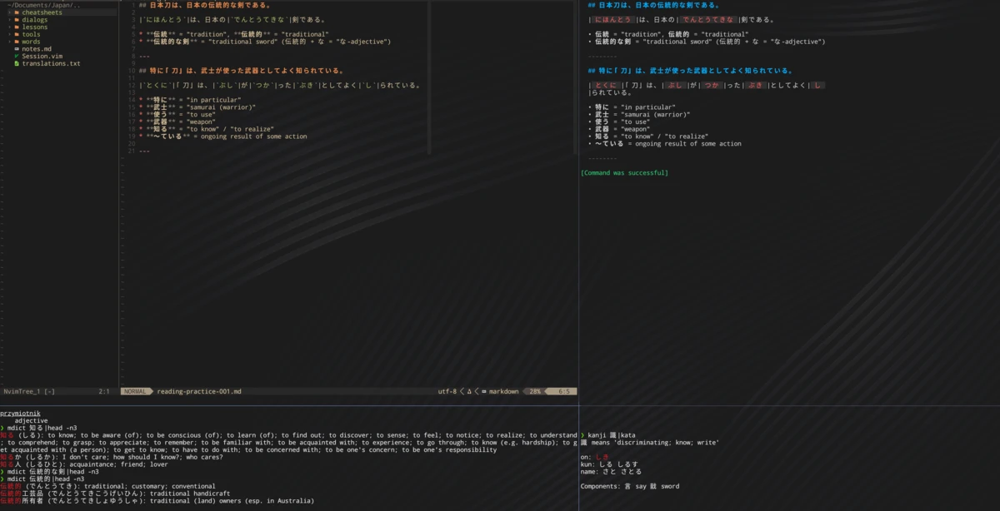
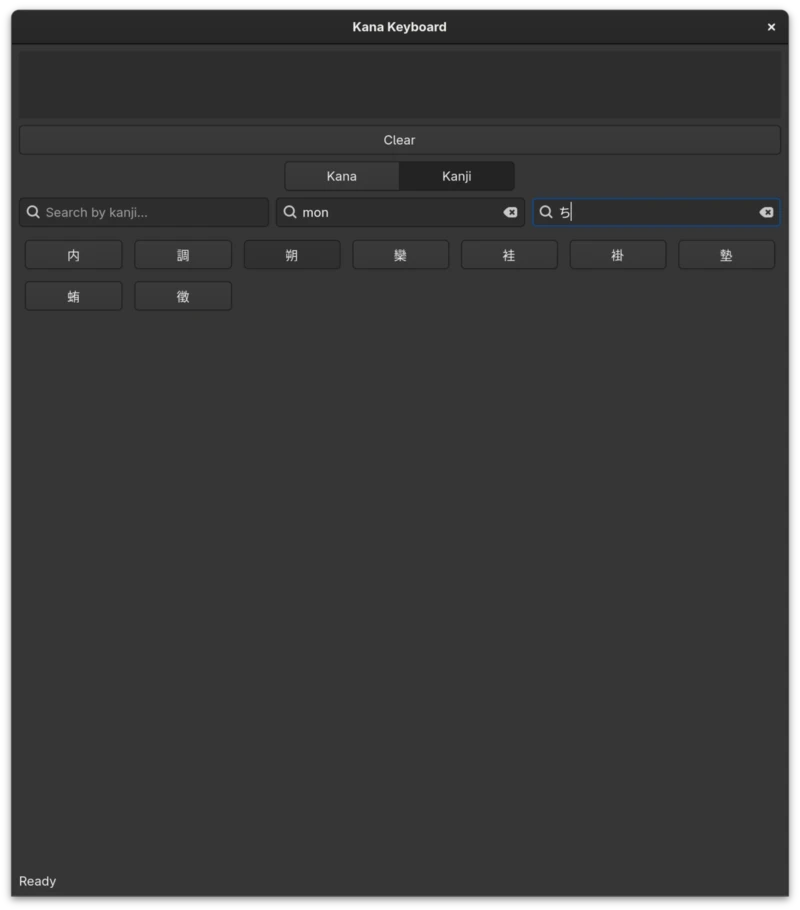

# JPN Toolset

This is a collection of tools that help me learn the Japanese language.

This repository contains a couple of mini-projects — mostly simple Python programs and scripts.

It rely mostly on FOSS tools and contains, among others:

* search for kanji definitions
* import kanji definitions from **KANJIDIC2** and **KanjiVG**
* on-screen kana/kanji keyboard frontend made with **GTK 4**
* wrapper for *Whisper* generating Japanese transcriptions from `.wav` files
* scripts for extracting audio and remuxing `.mkv` containers with **ffmpeg** and **MKVToolNix** tools
* katakana to hiragana command line converter
* offline Japanese/English dictionary built with **JMdict** open database

## ⚠️ Work in Progress

**Important:** This project is currently in early stage of development.

## So why not *the ultimate Japanese learning tool powered by AI*?

Because learning Japanese is mostly about reading, looking things up, and
repeating that process thousands of times.

These tools are designed to make that loop as fast and frictionless as possible, and integrate naturally with a terminal workflow.

## Typical workflow

## Kana keyboard

